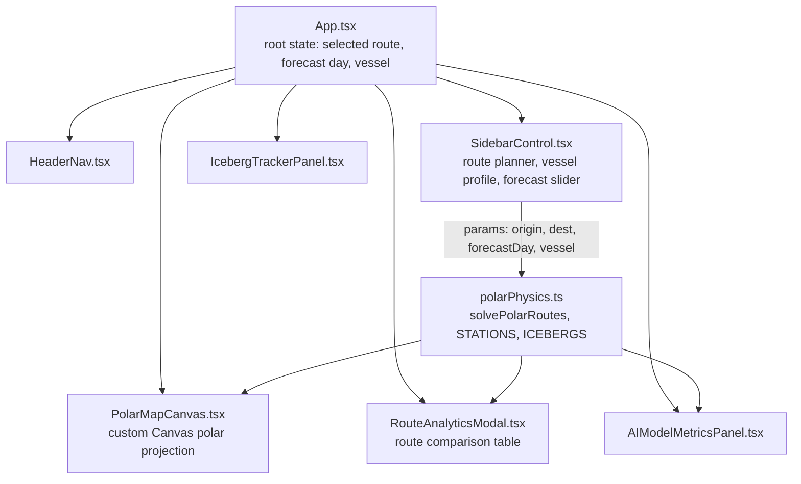

# PolarNav AI

**AI-Enabled Antarctic Sea-Ice, Iceberg Trajectory & Navigation Decision Support System**

Built for **SIH26059**, a Smart India Hackathon 2026 problem statement from the **Ministry of Earth Sciences (MoES) — National Centre for Polar and Ocean Research (NCPOR)**.

> A decision-support dashboard that helps plan safer, more fuel-efficient Antarctic research-vessel routes by forecasting sea-ice concentration, predicting iceberg drift, and comparing route options against a vessel's real structural ice-breaking limits.

---

## Table of Contents
- [Overview](#overview)
- [Core Features](#core-features)
- [Tech Stack](#tech-stack)
- [Architecture](#architecture)
- [Project Structure](#project-structure)
- [Getting Started](#getting-started)
- [How It Works](#how-it-works)
- [Data & Model Disclaimer](#data--model-disclaimer)
- [Roadmap](#roadmap)
- [Real-World Data Sources (Future Integration)](#real-world-data-sources-future-integration)
- [Known Limitations](#known-limitations)
- [Team Notes / Contributing](#team-notes--contributing)

---

## Overview

Indian research vessels sailing to Antarctica need continuously updated answers to three questions: where is sea ice thick or thin, where are icebergs likely to drift, and what is the safest, most fuel-efficient route given both. Today this relies heavily on manual satellite-image interpretation and static bulletins.

**PolarNav AI** is a prototype decision-support dashboard that visualizes this problem end-to-end: an interactive polar map, a day-by-day forecast horizon, multiple candidate routes scored on safety/fuel/time, and — critically — a plain-language explanation of *why* the recommended route deviates from the shortest path.

This is a **hackathon prototype**, not an operational maritime safety system. See [Data & Model Disclaimer](#data--model-disclaimer) below.

---

## Core Features

### Mission Control Dashboard
- Dark, glassmorphism "mission control" visual theme.
- Top status bar showing (illustrative) live data-feed indicators: Sentinel-1 SAR, AMSR2 ice mesh day offset, and quick links to Mission Briefing, Iceberg Monitor, and Route Analytics.

### Expedition Route Planner (Sidebar)
- Choose origin port/anchorage and destination station.
- Quick-select presets for common voyages (e.g. Cape Town → Bharati, Cape Town → Maitri, Prydz Bay → Bharati).
- Research Vessel Profile card: polar class rating, ice-breaking capacity, and base fuel burn for the selected vessel.

### AI Forecast Horizon
- A Day 0–7 slider that scrubs the entire dashboard through a forecast window — ice concentration, iceberg positions, and route recommendations all update against the selected day.
- Autoplay option to step through the forecast automatically.
- Sea-Ice Concentration (SIC) metrics for origin and destination, plus a model forecast-confidence score.

### Interactive Polar Map
- Custom HTML5 Canvas-rendered stereographic polar projection centered on Antarctica (no external mapping library).
- Route rendering: AI-optimal route, a direct/hazard comparison route, and a coastal (inefficient) comparison route, each with distinct line styles.
- Iceberg markers color-coded by hazard level, with a live vessel marker showing current speed and ice exposure.
- Zoom, pan, and hover interactions with a docked map legend.

### "Why This Path?" Route Rationale Panel
- A plain-language explanation of why the AI route deviates from the direct route on the currently selected day — e.g. how close the direct route would pass to a specific named iceberg, versus the clearance the AI route maintains, plus an ice-concentration comparison between the two paths.

### Route Analytics
- Side-by-side comparison table of all candidate routes: distance, transit time, fuel burn, average ice concentration, and a composite safety index.
- Structural feasibility checks against the selected vessel's ice-breaking capacity — routes that would exceed the vessel's rated ice-breaking limit are flagged and marked infeasible rather than silently recommended.

### Mission Briefing / Safety Assessment
- A dedicated safety-verdict summary for the selected voyage (e.g. "Unsafe Mission" / "Cleared") with the specific structural or hazard violation called out, plus trajectory forecast confidence.

### Iceberg Monitor
- Dedicated panel/tracker view for iceberg positions, size, and drift trajectory over the forecast window.

---

## Tech Stack

| Layer | Choice | Notes |
|---|---|---|
| Frontend framework | React 18 + TypeScript | `src/App.tsx` as root, function components throughout |
| Build tool | Vite 5 | Fast dev server + build (`npm run dev`, `npm run build`) |
| Map rendering | Native HTML5 Canvas 2D API | Custom stereographic polar projection — intentionally not Leaflet/Mapbox, to keep the visual style fully custom |
| Icons | lucide-react | Consistent icon set across sidebar/header |
| Styling | Plain CSS with custom properties (`src/index.css`) | Dark glassmorphism theme via CSS variables — no Tailwind/UI library |
| Linting | ESLint (TypeScript-aware) | `npm run lint` |

No backend, database, or external API calls exist in the current codebase — all data is defined locally in TypeScript (see [Data & Model Disclaimer](#data--model-disclaimer)).

---

## Architecture



The app currently runs entirely client-side: `polarPhysics.ts` computes (or, for select station pairs, looks up hardcoded) route waypoints, ice-concentration estimates, and iceberg positions based on the current `params` object (origin, destination, forecast day, selected vessel), and every visual component re-renders from that single computed result.

---

## Project Structure

```
PolarNav AI/
├── index.html                     # Vite entry HTML
├── package.json                   # Dependencies & scripts
├── tsconfig.json
├── vite.config.ts
└── src/
    ├── main.tsx                   # React root mount
    ├── App.tsx                    # Root component & app state
    ├── index.css                  # Theme variables + all component styling
    ├── components/
    │   ├── HeaderNav.tsx          # Top status bar & navigation
    │   ├── SidebarControl.tsx     # Route planner, vessel profile, forecast slider
    │   ├── PolarMapCanvas.tsx     # Canvas-based interactive polar map
    │   ├── RouteAnalyticsModal.tsx# Route comparison table
    │   ├── AIModelMetricsPanel.tsx# Model confidence / metrics display
    │   └── IcebergTrackerPanel.tsx# Iceberg monitor view
    ├── utils/
    │   └── polarPhysics.ts        # Core "physics"/data layer: stations,
    │                               # icebergs, route solving logic
    └── types/
        └── index.ts                # Shared TypeScript types (RouteOption,
                                      # Waypoint, Iceberg, Vessel, etc.)
```

---

## Getting Started

### Prerequisites
- Node.js (LTS recommended)
- npm

### Install & Run
```bash
cd "PolarNav AI"
npm install
npm run dev
```
This starts the Vite dev server (default `http://localhost:5173`).

### Build for Production
```bash
npm run build
npm run preview   # serve the production build locally
```

### Lint
```bash
npm run lint
```

---

## How It Works

1. **User sets voyage parameters** in the sidebar — origin, destination, vessel, and forecast day.
2. **`polarPhysics.ts` resolves the route(s).** For the currently supported preset station pairs, this uses hand-authored, deterministic per-day scenario data so behavior is consistent and explainable across the full 0–7 day forecast window; for other station combinations, a procedural fallback generates route geometry and ice/iceberg estimates.
3. **`PolarMapCanvas.tsx` renders everything** — coastline, ice concentration shading, iceberg markers, and each candidate route — using a custom lat/lon → canvas-coordinate stereographic projection.
4. **`RouteAnalyticsModal.tsx` and the rationale panel explain the recommendation** — each route is checked against the selected vessel's rated ice-breaking capacity, and any route that would exceed that limit is marked infeasible rather than presented as viable, regardless of how efficient it looks on paper.

---

## Data & Model Disclaimer

**This is a hackathon prototype, not an operational or certified maritime safety tool.** Specifically:

- Sea-ice concentration, iceberg positions/trajectories, ocean currents, and route feasibility numbers are currently **hand-authored/simulated data** designed to be internally consistent and illustrative of real Antarctic conditions — not live satellite feeds.
- The iceberg drift and route-safety logic are simplified stand-ins for what a production system would compute from real AMSR2/Sentinel-1 satellite data, Copernicus Marine Service ocean currents, and ERA5/GFS weather data.
- No live external APIs are currently called; "LIVE" indicators in the UI are illustrative of the intended production behavior.
- See the [Roadmap](#roadmap) and [Real-World Data Sources](#real-world-data-sources-future-integration) sections for what a production-grade version would require.

We believe this honest framing is a strength, not a weakness, for a hackathon evaluation — it demonstrates the decision-support logic and UX clearly without overclaiming operational readiness.

---

## Roadmap

Designed and specified, in various stages of implementation:

- [x] Interactive Canvas-based polar map with zoom/pan/hover
- [x] Multi-route comparison (AI-optimal vs. direct vs. coastal)
- [x] Forecast-day-driven vessel position (ship position follows the Day 0–7 slider instead of an independent animation loop)
- [x] Iceberg positions read from authored day-by-day trajectory data
- [x] "Why this path?" plain-language route rationale panel
- [x] Structural feasibility checks against vessel ice-breaking capacity
- [ ] Fully consistent feasibility logic across all routes/days/station pairs (single shared feasibility function, no route exempted from its own displayed warnings)
- [ ] Expanded iceberg field (more, smaller icebergs) with enforced minimum AI-route clearance distance
- [ ] Additional station-pair coverage beyond the current presets
- [ ] Real backend (FastAPI) serving forecasts computed from actual satellite/ocean/weather data, replacing the current client-side mock data layer
- [ ] Persistent storage / historical playback of past forecasts
- [ ] Multi-vessel fleet view
- [ ] Authentication & role-based access (scientist vs. navigator)

---

## Real-World Data Sources (Future Integration)

For a production version, the following free/public data sources are the intended replacements for the current mock data:

| Data | Source | Purpose |
|---|---|---|
| Sea-ice concentration | NSIDC AMSR2 (NSIDC-0803) / University of Bremen ASI product | Forecast model input & ice-concentration overlay |
| Ocean currents | Copernicus Marine Service (CMEMS) | Iceberg drift model input |
| Wind / weather | ECMWF ERA5 (via Copernicus CDS) / NOAA GFS | Iceberg drift model input |
| Iceberg tracking (validation) | Antarctic Iceberg Tracking Database (BYU/NASA) | Ground truth to validate drift predictions |
| Sea-ice charts | US National Ice Center (SIGRID-3) | Cross-check / alternative ice-edge boundary source |

All of the above are free and require only account registration (NASA Earthdata / Copernicus CDS / CMEMS) — recommended to set up well ahead of any live-data integration work.

---

## Known Limitations

- All routing/forecast data is currently local, hardcoded/mocked — see [disclaimer](#data--model-disclaimer) above.
- The Canvas-based map has no built-in GIS tooling (no real coastline geometry, no true geodesic distance calculations) — coordinates and shapes are simplified/illustrative.
- Feasibility-check consistency across all routes and forecast days is an active fix in progress (see Roadmap) — always cross-check the Route Analytics warnings against the Select/Active Route state before treating any comparison as final.
- No automated test suite currently exists.
- No backend/persistence layer — all state resets on page reload.

---

## Team Notes / Contributing

- Keep `src/types/index.ts` as the single contract for data shapes shared across components — coordinate any type changes with whoever owns the corresponding UI component.
- When adding new hardcoded route/iceberg data, keep it consistent with existing entries in `polarPhysics.ts` (and any scenario data files) so forecast-day progressions tell a coherent day-by-day story.
- Prototype built as part of an SIH26059 submission for NCPOR (Ministry of Earth Sciences). Not affiliated with or endorsed by NCPOR/MoES as an operational tool.
